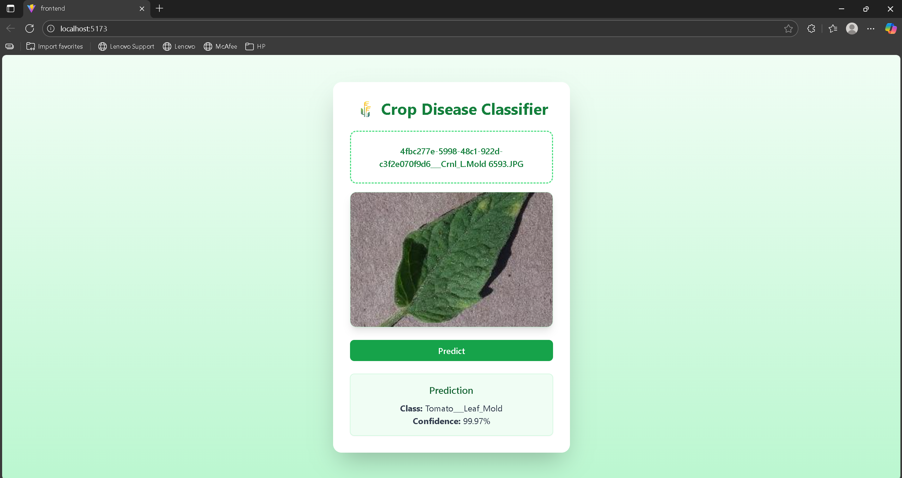
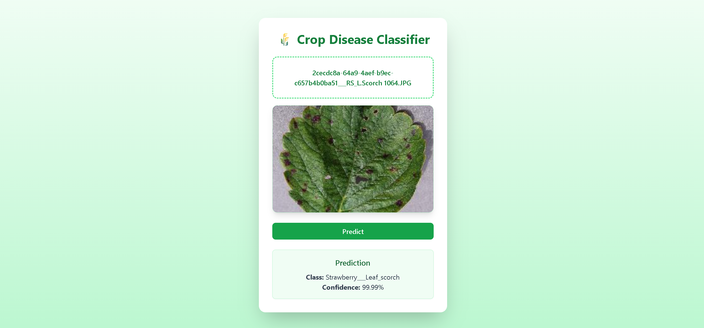

# Crop Disease Classifier

An AI-powered web application that identifies crop diseases from leaf images using a fine-tuned EfficientNetB0 model.  
Built with **FastAPI** (backend) and **React + Vite** (frontend).

---

## Features
- Upload a leaf image and get instant predictions.
- Displays predicted disease class and confidence score.
- Simple, responsive, and fast interface.

---

## Tech Stack
- **Frontend:** React + Vite + Axios + TailwindCSS  
- **Backend:** FastAPI + TensorFlow/Keras + Uvicorn  
- **Model:** EfficientNetB0 (fine-tuned on 38 crop disease classes)

---

## Model Evaluation Results

| Metric       | Value   |
|---------------|---------|
| **Test Accuracy** | 94.42% |
| **Test Loss**     | 0.22   |

---

## Setup Instructions

### Clone the Repository
```bash

git clone https://github.com/Shadabkhan2004/Crop-Disease-Classification.git
cd Crop-Disease-Classification

```

### Back-end setup
```bash

cd api
pip install -r requirements.txt
uvicorn app:app --reload

```
### Front-end setup
```bash

cd ../frontend
npm install
npm run dev


```

### Web App Demo




